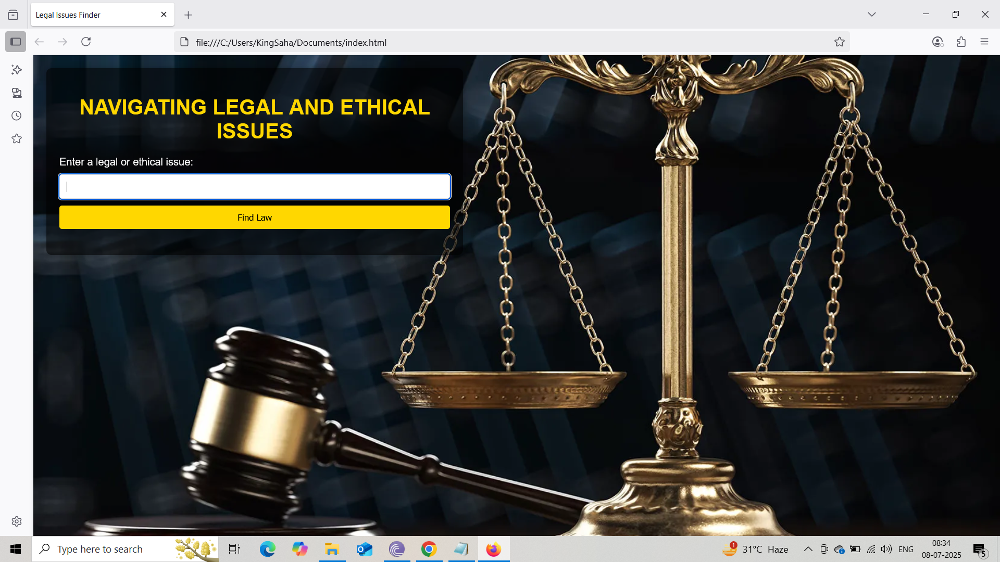
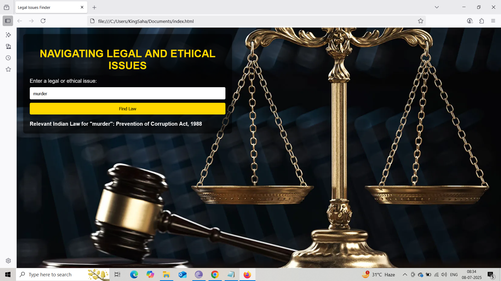

# legal-ethical-issues-navigator
A tool to find Indian laws related to legal and ethical issues.
# 🔍 Navigating Legal and Ethical Issues (Indian Law Finder)

This project is a web-based tool designed to assist users in quickly identifying relevant **Indian laws** based on entered **legal or ethical issues**. With a simple and intuitive interface, the system suggests corresponding Indian acts, regulations, or sections that address a particular issue.

---

## 📌 Features

- ✅ User-friendly interface for legal/ethical issue lookup  
- 🇮🇳 Matches issue keywords with **relevant Indian laws**  
- ⚖️ Highlights laws on topics like privacy, cybersecurity, harassment, and more  
- 🚀 Fast similarity-based text matching to detect closely related issues  
- 💡 Educates users on real laws used in India for awareness and compliance  

---

## 💻 Tech Stack

| Tool | Usage |
|------|-------|
| HTML | Page structure |
| CSS | Styling and layout |
| JavaScript | Logic, matching algorithm |
| JSON-like object | Law dictionary database |

---

## 🧠 How It Works

1. User inputs a legal or ethical issue (e.g., "cybersecurity", "privacy").
2. JavaScript compares the input with a dictionary of Indian laws.
3. Closest match is found using a basic similarity function.
4. The matched law is displayed on the screen.

---

## 🧪 Example Issues

| Input Issue            | Suggested Law |
|------------------------|----------------|
| privacy                | Information Technology Act, 2000 – Section 43A |
| employment discrimination | Equal Remuneration Act, 1976 |
| insider trading        | SEBI Act, 1992 – Section 15G |
| data breach            | IT Rules, 2011 |
| workplace harassment   | POSH Act, 2013 |

---

## 📁 Project Structure

📁 legal-ethical-issues/
├── index.html # Main interface
├── project.css # Styling for the webpage
└── project.js # JavaScript logic (matching and output)

---


## 🚀 Getting Started

### 🛠 Run Locally

1. Clone the repository:
   ```bash
   git clone https://github.com/your-username/legal-ethical-issues.git
Open index.html in any web browser.

Start typing an issue and explore the matching Indian laws.


